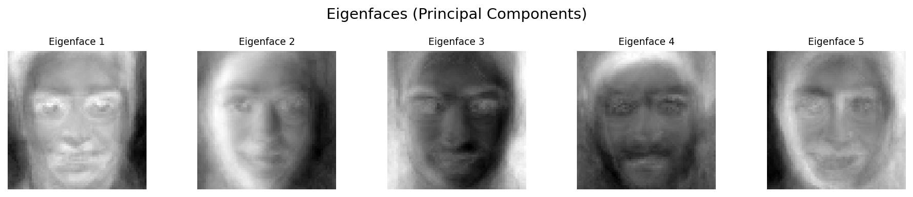
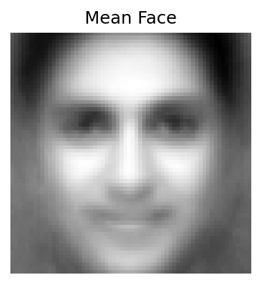
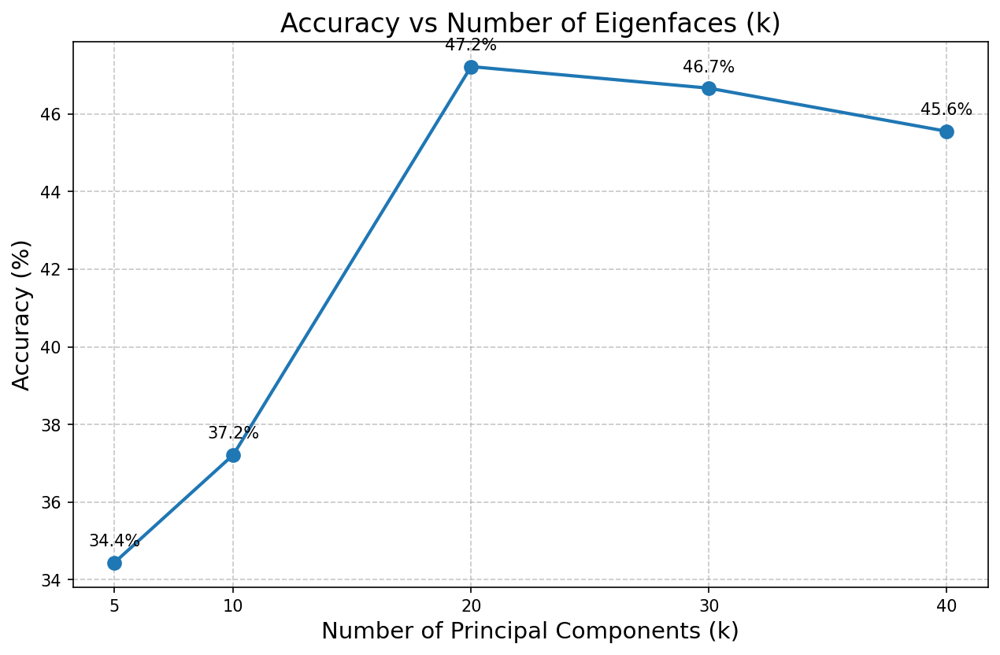
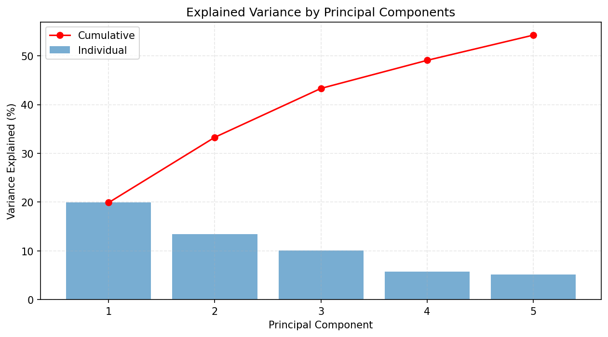
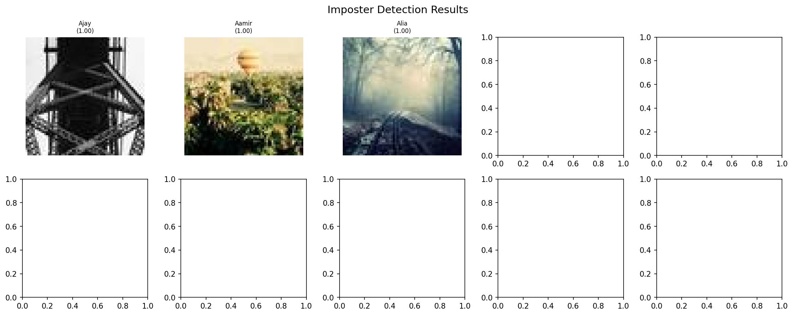

# Face Recognition System using PCA (Eigenfaces) + ANN

[](https://facerecognition-pca-ann.streamlit.app)
[](https://python.org)
[](https://github.com/kalyan870/FaceRecognition-PCA-ANN)

A complete face recognition system that combines **Principal Component Analysis (PCA)** for dimensionality reduction and feature extraction (Eigenfaces) with an **Artificial Neural Network (ANN)** for classification.


*Top eigenfaces learned from the training dataset — each eigenface captures a mode of facial variation.*

## Methodology

### PCA (Principal Component Analysis)

PCA transforms high-dimensional face images into a lower-dimensional subspace by finding the directions (principal components) that maximize variance. The principal components, when visualized, resemble face-like patterns called **Eigenfaces**.

**Steps:**
1. Flatten each face image (m×n) into a vector
2. Build a data matrix (p images × mn pixels)
3. Compute the **mean face**
4. Normalize by subtracting the mean face
5. Compute the surrogate covariance matrix: **C = Δ·Δᵀ** (using the smaller p×p matrix for efficiency)
6. Perform eigenvalue decomposition using `np.linalg.eig()`
7. Select top-k eigenvectors (Eigenfaces)
8. Project face data onto the eigenface subspace


*The mean face — average of all training images after alignment.*

### ANN (Artificial Neural Network)

A multi-layer perceptron (MLP) classifier from scikit-learn that learns to map PCA-reduced face features to person identities.

**Architecture:**
- **Input Layer:** k PCA features (dimensionality reduced from 4096 pixels)
- **Hidden Layer 1:** 128 neurons with ReLU activation
- **Hidden Layer 2:** 64 neurons with ReLU activation
- **Output Layer:** 9 persons with Softmax

## Results

### Accuracy vs Number of Eigenfaces (k)

The system is evaluated across different k values (5, 10, 20, 30, 40) on a dataset of 9 individuals (Bollywood celebrities) with 450 total images (60% train, 40% test):

| k   | Explained Variance | Accuracy |
|-----|-------------------|----------|
| 5   | 54.25%            | 34.44%   |
| 10  | 66.81%            | 37.22%   |
| 20  | 76.99%            | 47.22%   |
| 30  | 82.05%            | 46.67%   |
| 40  | 85.52%            | 45.56%   |

**Best k = 20** with **47.22%** accuracy. The accuracy increases with more components up to a point, then plateaus — a classic eigenface behavior pattern.


*Accuracy at different k values — shows the tradeoff between dimensionality and performance.*

### Explained Variance


*Individual and cumulative explained variance — shows how much facial information each eigenface captures.*

### Imposter Detection

Faces not present in the training set are classified as **"Unknown (Imposter)"** when the maximum Softmax probability falls below a confidence threshold (0.6).


*Imposter detection results — non-training faces are flagged based on confidence thresholds.*

## Live Demo

Try the live Streamlit app:

[](https://facerecognition-pca-ann.streamlit.app)

## Project Structure

```
FaceRecognition_PCA_ANN/
├── dataset/
│   ├── train/          # Training images (60%)
│   ├── test/           # Testing images (40%)
│   └── imposters/      # Unknown faces for testing
├── src/
│   ├── preprocess.py   # Image loading & preprocessing
│   ├── pca.py          # PCA implementation (Eigenfaces)
│   ├── eigenfaces.py   # Eigenface visualization
│   ├── ann_model.py    # ANN (MLPClassifier) model
│   ├── train.py        # Training pipeline
│   ├── test.py         # Testing & imposter detection
│   └── utils.py        # Utility functions
├── outputs/
│   ├── graphs/         # Accuracy & variance graphs
│   ├── eigenfaces/     # Eigenface visualizations
│   ├── predictions/    # Prediction results
│   └── models/         # Saved PCA + ANN models
├── screenshots/        # README screenshots
├── notebooks/
│   └── face_recognition.ipynb  # Jupyter notebook
├── streamlit_app.py    # Streamlit web app
├── app.py              # CLI entry point
├── prepare_dataset.py  # Dataset download & organization
├── requirements.txt    # Dependencies
└── README.md           # This file
```

## Usage

### Installation

```bash
pip install -r requirements.txt
```

### Prepare Dataset

```bash
python prepare_dataset.py
```

Or manually place images in `dataset/train/<person_name>/` and `dataset/test/<person_name>/`.

### Run Full Pipeline

```bash
python app.py --mode full
```

### Train Only

```bash
python app.py --mode train
```

### Test Only

```bash
python app.py --mode test
```

### Test Single Image

```bash
python app.py --mode test --image path/to/image.jpg
```

### Run Streamlit App

```bash
streamlit run streamlit_app.py
```

### Custom k Values

```bash
python app.py --mode full --k_values 5 10 20 30 40
```

## Dataset

The dataset consists of face images of 9 Bollywood celebrities:
- **Aamir, Ajay, Akshay, Alia, Amitabh, Deepika, Disha, Farhan, Ileana**
- 50 images per person (450 total)
- 60% training (30 per person) / 40% testing (20 per person)

## Tech Stack

- **Python** — Core programming language
- **OpenCV** — Image reading and preprocessing
- **NumPy** — Linear algebra and matrix operations
- **Scikit-learn** — ANN (MLPClassifier)
- **Matplotlib** — Visualization and plotting
- **Streamlit** — Web application framework
- **Jupyter Notebook** — Interactive exploration

## License

MIT
