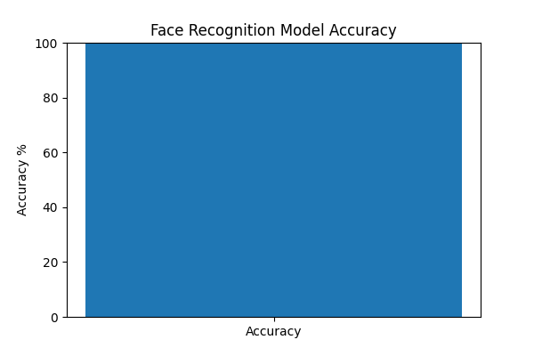
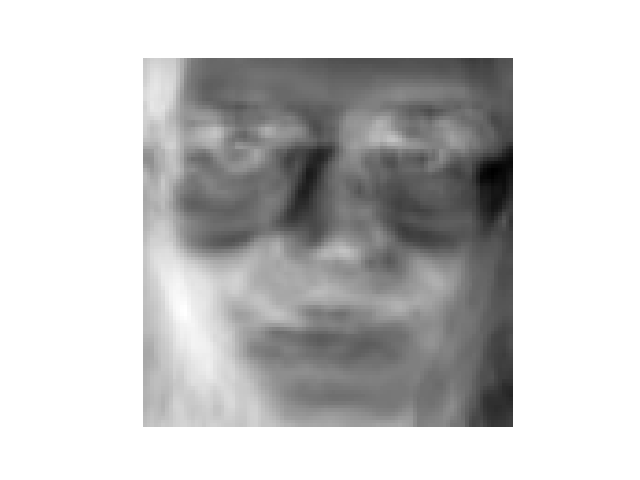

# PCA + ANN Face Recognition System using Machine Learning

## Overview
This project implements a Face Recognition System using Principal Component Analysis (PCA) and Artificial Neural Network (ANN).

## Features
- Face Recognition
- PCA Eigenfaces
- ANN Classification
- Accuracy Visualization
- Streamlit Deployment

## Tech Stack
- Python
- OpenCV
- Scikit-learn
- Streamlit
- NumPy
- Matplotlib

## Live Demo
https://appapppy-82gfkkrhjfskrpay5mtyqz.streamlit.app/

## GitHub Repository
https://github.com/kalyan870/FaceRecognition-PCA-ANN

## Output Screenshots

### Home UI


### Accuracy Graph


### Eigenfaces



### Training Output
```
Loading Dataset...
Total Images Loaded: 60
Applying PCA...
Training ANN Model...
Model Accuracy: 100.00%
Model Saved Successfully!
Accuracy Graph Saved!
Eigenfaces Saved!
Training Completed Successfully!
```
